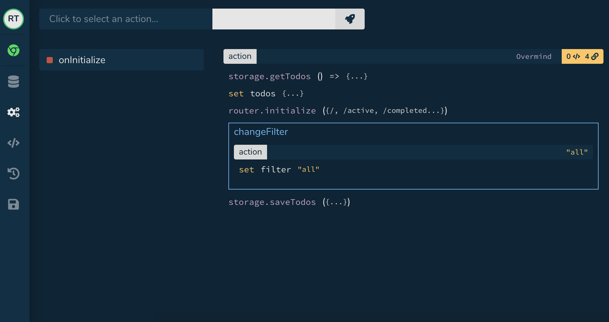
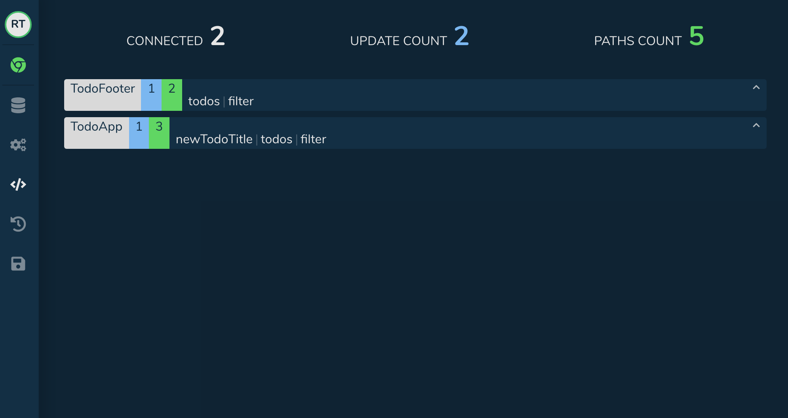
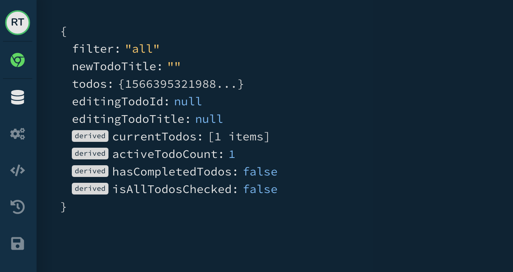
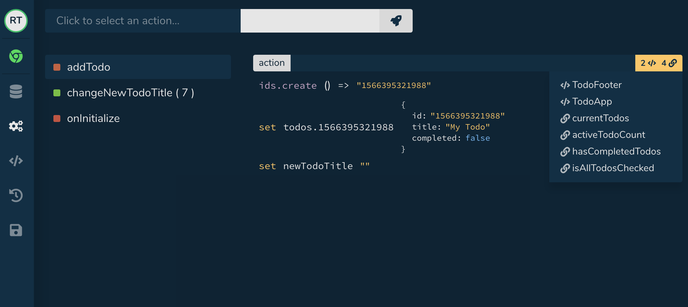

# Introduction

In this introduction you will get an overview of Overmind and how you can think about application development. We will be using [REACT](https://reactjs.org/) to write the UI, but you can use Overmind with [VUE](https://vuejs.org/) and [ANGULAR](https://angular.io/) if either of those is your preference.


If you rather want to go right ahead and set up a local project, please have a look at the [QUICKSTART](quickstart.md) guide.


Before we move on, have a quick look at this sandbox. It is a simple counter application and it gives you some foundation before talking more about Overmind and building applications.











As you can see we only have to add an **Action** type to our functions and optionally give it an input type. This is enough for the action to give you all information about the application. Try changing some code and even add some code to see how Typescript helps you to explore the application and ensure that you implement new functionality correctly.

If you go to the **state.ts** file and change the type:

```typescript
export type State = {
  ...,
  newTodoTitle: string
  ...
}
```

to:

```typescript
export type State = {
  ...,
  todoTitle: string
  ...
}
```

You can now visit the **actions.ts** file and the **AddTodo.tsx** component. As you can see Typescript yells because the typing is now wrong. This is very powerful in complex projects which moves fast. The reason being that you can safely rename and refactor without worrying about breaking the code.

To learn more about Overmind and Typescript read the [TYPESCRIPT](https://www.overmindjs.org/guides/beginner/05_typescript) documentation.

## Development tool

Overmind also ships with its own development tool. It can be installed as a [VSCODE PLUGIN](https://marketplace.visualstudio.com/items?itemName=christianalfoni.overmind-devtools-vscode) or installed as an NPM package. The development tool knows everything about what is happening inside the application. It shows you all the state, running actions and connected components. By default Overmind connects automatically to the devtool if it is running.

Open the **sandbox** above and try by going to the **index.tsx** file and change:

```typescript
export const overmind = createOvermind(config, {
  devtools: false,
});
```

to:

```typescript
export const overmind = createOvermind(config, {
  devtools: true,
});
```

Go to your terminal and use the NPM executor to instantly fire up the development tool.

```text
npx overmind-devtools@latest
```

Refresh the sandbox preview and you should see the devtools populated with information from the application.


This only works in **CHROME** when running on codesandbox.io, due to domain security restrictions. It works on all browsers when running your project locally.



Here we get an overview of the current state of the application, including our derived state. If we move to the next tab we get an overview of the execution. We have not triggered any actions yet, but our **onInitialized** hook has run and triggered some logic.



Here we can see that we grabbing todos from local storage and initializing our router. We can also see that the router instantly fires off our **changeFilter** action causing a state change on the filter. At the end we can see that our reaction triggered, saving the todos.


You might wonder why the reaction triggered when it was defined after we changed the **todos** state. Overmind batches up changes to state and _flushes_ at optimal points in the execution. For example when an action ends or some asynchronous code starts running. The reaction reacts to these flushes, just like components do.


Moving on we also get insight into components looking at our application state:



Currently two components are active in the application and we can also see what state they are looking at.

A chronological list of all state changes and effects run is available on the next tab. This can be useful with asynchronous code where actions changes state “in between” each other.


Now, let us try to add a new todo and see what happens.



Our todo has been added and we can even see how the derived state was affected by this change. Looking at our actions tab we can see what state changes were performed and by hovering the mouse on the yellow label up right you get information about what components and derived were affected by state changes in this action.



## Managing complexity


Overmind gives you a basic foundation with its **state**, **actions** and **effects**. As mentioned previously you can split these up into multiple namespaces to organize your code. This manages the complexity of scaling. There is also a complexity of reusability and managing execution over time. The **operators** API allows you to split your logic into many different composable parts. With operators like **debounce**, **waitUntil** etc. you are able to manage execution over time. With the latest addition of **statemachines** you have the possiblity to manage the complexity of state and interaction. What interactions should be allowed in what states. And with state values as **class instances** you are able to co-locate state with logic.

The great thing about Overmind is that none of these concepts are forced upon you. If you want to build your entire app in the root namespace, only using actions, that is perfectly fine. You want to bring in operators for a single action to manage time complexity, do that. Or do you have a concept where you want to safely control what actions can run in certain states, use a statemachines. Overmind just gives you tools, it is up to you to determine if they are needed or not.

## Moving from here

We hope this introduction got you excited about developing applications and working with Overmind. From this point you can continue working with [CODESANDBOX.IO](https://codesandbox.io/) or set up a local development flow. It is highly encouraged to use Overmind with Typescript, it does not get any more complex than what you see in this simple TodoMvc application.

Move over to the [QUICKSTART](quickstart.md) to get help setting up your project. The other guides will give you a deeper understanding of how Overmind works. If you are lost please talk to us on [DISCORD](https://discord.gg/YKw9Kd) and we are happy to help. And yeah… have fun! :-\)

